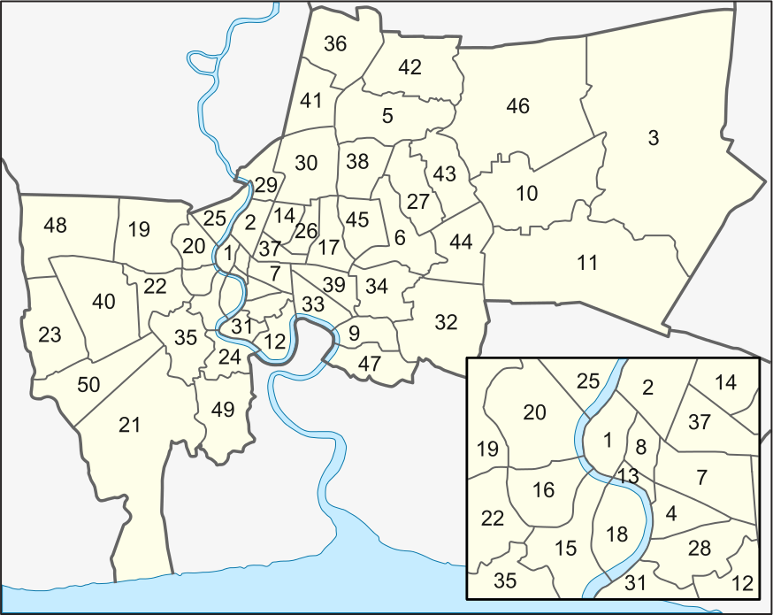

<!-- # Exploratory Data Analysis {#exploration} -->

# Materials and Methods {#materials}

## Study Area


Our aim is to predict the dengue outbreak in each of its several districts shown in Figure \@ref(fig:bkk-map).  

```{r bkk-map, fig.cap= ' The map of Bangkok with enumerated 50 districts (Image Source: [@wikiBKK])', out.width='80%', fig.asp=.75, fig.align='center', echo=FALSE}


```

<!-- I import the important the following packages into R.  -->

```{r LoadPackages, echo=FALSE, message=FALSE}

require(ggplot2) # used in plotting 
require(reshape)
require(plotly)
require(bnlearn) # used for Bayesian Networks
require(mgcv)    # used for Generalized Additive Modeling 
require(fpp)
require(lubridate)
require(bsts)
require(dplyr)
require(CausalImpact)
require(xtable)
library(dplyr)
library(tidyr)
library(htmlwidgets)
library(DT)


```

Now, let's look at some of the descriptive statistics of dengue in Bangkok from year 2008 to 2015. We have the data available for each month throughout the year, however in a few cases data from some of the districts is missing. I will report about the missing data when it is required for our analysis. We have the data about following variables.

1. **Monthly Dengue Incidence (MD)** (for each district) 
    - Dengue Fever (DF) data.
    - Dengue Haemorrhagic Fever (DHF) and
    - Dengue Shock Syndrome (DSS)
    
2. **Meteorological Variables** (uniform for all districts in Bangkok)
    - Monthly Average Rainfall (MR)
    - Monthly Diurnal Temperature Range (DTR)
  
3. **Socio-Economic Data** (for each district)
    - Population Demographics in different age groups (2014)
    - Number of communities (schools, hospitals, meetup centers etc.) in 2011. 
    - Yearly Garbage Collection  (2012 to 2014).
    
4. **Location Specific Data** (for each district) 
    - Attached to the river stream. 
    - Distance from the river stream. 
    


<!-- I import the relevant data into different variables  -->


```{r ConnectedDistrict, echo=FALSE, results='hide' }

## The data about connection of one district to another. I am not sure if there are no mistakes in this dataset. 

connected_district <- read.csv("E:/Dengue Forecasting Project/DataAndCode/Datasets/prepare_data/connected_district.csv")
connected_district <- connected_district[,-2] # I removed the Thai name
head(connected_district)


```

```{r ConnectedDistrictCode, echo=FALSE, results='hide' }

## Correctedness guranteed. Personally verified. 

connected_district_code <- read.csv("E:/Dengue Forecasting Project/DataAndCode/Datasets/prepare_data/connected_district_code.csv", header = TRUE, check.names = FALSE)
head(connected_district_code)

```

```{r DistrictCode, echo=FALSE, results='hide'}
#Has geocodes, postal code of each of the district, their names, population and area.

district_code <- read.csv("E:/Dengue Forecasting Project/DataAndCode/Datasets/prepare_data/district_code.csv")
head(district_code)

```

```{r CommunityData, echo=FALSE, results='hide'}

# Tells about the number of communities, population from 2014, families and households. The family and household data are same. 

district_code_with_comunity_data <- read.csv("E:/Dengue Forecasting Project/DataAndCode/Datasets/prepare_data/district_code_with_comunity_data.csv")
head(district_code_with_comunity_data)

```

```{r GarbageData, echo=FALSE, results='hide'}

## The data is about garbage collected on average yearly within each district. Then divided by the number of days we get averaged daily data for each district as well.  

district_garbage_data <- read.csv("E:/Dengue Forecasting Project/DataAndCode/Datasets/prepare_data/district_garbage_data.csv")
head(district_garbage_data)

```

```{r DistrictCodes, echo=FALSE, results='hide'}
match_district_code_table <- read.csv("E:/Dengue Forecasting Project/DataAndCode/Datasets/prepare_data/match_district_code_table.csv")
head(match_district_code_table)
```

```{r DistrictPopulation, echo=FALSE, results='hide'}

## Result: It seems that district_population is most comprehensive. 

district_population <- read.csv("E:/Dengue Forecasting Project/DataAndCode/Datasets/prepare_data/district_population.csv")
head(district_population)
```

## Meteorological Data 

### Temperature

The temperatur data is collected as Diurnal Temperature Range abbreviated as DTR.  DTR is the difference between the daily maximum and minimum temperature. It is shown in Table \@ref(tab:DTRTable).  

```{r DTR, echo=FALSE,  results='hide'}

AverageDTRInBangkok_2008.2015 <- read.csv("E:/Dengue Forecasting Project/DataAndCode/Datasets/prepare_data/AverageDTRInBangkok_2008-2015.csv",check.names = FALSE)

AverageDTRInBangkok_2008.2015 <- subset(AverageDTRInBangkok_2008.2015, select = -2) # we remove the data of 2016
AverageDTRInBangkok_2008.2015[,"Month"] <- month.abb
AverageDTRInBangkok_2008.2015
summary_DTR <- subset(AverageDTRInBangkok_2008.2015, select = -c(Month))

# Melting data to put all data on the same plot
meltdf <- melt(AverageDTRInBangkok_2008.2015, id.vars = "Month")
# Everything on the same plot
meltdf$Month <- factor(meltdf$Month, levels = AverageDTRInBangkok_2008.2015$Month)
```


```{r DTRTable, echo=FALSE, comment=NA}
knitr::kable(AverageDTRInBangkok_2008.2015, booktabs = TRUE,
  caption = 'Monthly DTR within the city from 2008 to 2015.'
)
```

The visualization of DTR within Bangkok throughout the years is shown in Fig \@ref(fig:bkk-DTR1) and Fig \@ref(fig:bkk-DTR2). 

```{r bkk-DTR1, fig.cap= 'DTR within Bangkok throughout the years put together shown individually.', fig.align='center', echo=FALSE}


plot.ts(summary_DTR, main = "DTR in Bangkok throughout the years shown individually")


```


```{r bkk-DTR2, fig.cap= 'DTR within Bangkok throughout the years put together.', fig.align='center', echo=FALSE}

ggplot(meltdf,aes(x=Month,y=value,colour=variable,group=variable)) + geom_line(size=1.5) + ggtitle("The diurnal temperature range (DTR) in Bangkok (2008-2015)") + labs(x="Months",y="DTR (Celsius)") 

```


### Rainfall 

The data for average monthly rainfall in Bangkok is shown in Table \@ref(tab:RainTable).  

```{r Rain, echo=FALSE,  results='hide'}

AverageRainInBangkok_2008.2015 <- read.csv("E:/Dengue Forecasting Project/DataAndCode/Datasets/prepare_data/AverageRainInBangkok_2008-2015.csv", check.names = FALSE)

AverageRainInBangkok_2008.2015 <- subset(AverageRainInBangkok_2008.2015, select = -2) #removing 2016
AverageRainInBangkok_2008.2015[,"Month"] <- month.abb
AverageRainInBangkok_2008.2015
summary_Rain<- subset(AverageRainInBangkok_2008.2015, select = -c(Month))


meltdf <- melt(AverageRainInBangkok_2008.2015, id.vars = "Month")
# Everything on the same plot
meltdf$Month <- factor(meltdf$Month, levels = AverageRainInBangkok_2008.2015$Month)

```


Plotting average monthly rainfall for all the years on the same plot.

```{r RainTable, echo=FALSE, comment=NA}
knitr::kable(AverageRainInBangkok_2008.2015, booktabs = TRUE,
  caption = 'Monthly Rainfall within the city from 2008 to 2015.'
)

```


```{r RainTogether, echo=FALSE, fig.cap= 'DTR within Bangkok throughout the years put together.', fig.align='center', echo=FALSE}

ggplot(meltdf,aes(x=Month,y=value,colour=variable,group=variable)) + geom_line(size=1.5) + ggtitle("Average Monthly Rainfall in Bangkok (2008-2015)") + labs(x="Months",y="Average Monthly Rainfall (mm)") 

```


## Dengue Incidences

In this study, we only use the data for DHF. 


```{r DengueSurveillaneData, echo=FALSE, message=FALSE , results= "hide"}

## Importing the data for dengue incidences
dengue_bangkok_district_level_2008.2015 <- read.csv("E:/Dengue Forecasting Project/DataAndCode/Datasets/prepare_data/dengue_bangkok_district_level_2008-2015.csv", header = TRUE)

# Checking the data
head(dengue_bangkok_district_level_2008.2015) 

## Taking the data only for DHF. The codes are:
# DF = 66
# DHF = 26
# DSS = 27 

DHF_bangkok_district_level_2008.2015 <- subset(dengue_bangkok_district_level_2008.2015, disease_code == 26)
DHF_bangkok_district_level_2008.2015 <- subset(DHF_bangkok_district_level_2008.2015, (date_sick_year > 2007) & (date_sick_year < 2016 ))
unique(DHF_bangkok_district_level_2008.2015$date_sick_year)

# Removing the columns about disease code and district codes. The yearly data is presented below
DHF_total_2008.2015 <- subset(DHF_bangkok_district_level_2008.2015, select = - c(geocode_district, disease_code ))
head(DHF_total_2008.2015)


## Aggregating the data on DHF, according to the year. 
totalDHF <- aggregate(count ~ date_sick_year, DHF_total_2008.2015,sum)

totalDHF

```


```{r DHFTotal, echo=FALSE, fig.cap= 'The DHF incidence peaked in 2013 and 2015. It seems that dengue outbreak increases every alternative year.', fig.align='center', echo=FALSE}

ggplot(totalDHF, aes(x = date_sick_year, y = count )) + geom_bar(stat = "identity")  + ggtitle("Reported annual DHF incidents in Bangkok (2008-2015)") + labs(x="Year",y="Yearly Count Data")

```

We can observe a trend in Fig \@ref(fig:DHFTotal) that dengue outbreak increases every alternative year. But is it really a pattern? Well, we don't have enough data for say that, however we will check and see if we can exploit this 'pattern' for better prediction of dengue.

```{r DegueSurveillaneData_Monthly, echo=FALSE, message=FALSE , results= "hide"}

totalDHF_month <- aggregate(count ~ date_sick_month, DHF_total_2008.2015, sum)
totalDHF_month$date_sick_month <- month.abb
totalDHF_month$date_sick_month  <- factor(totalDHF_month$date_sick_month, levels = month.abb)


```

```{r DHFMonthly, echo=FALSE, fig.cap= 'The DHF incidence peaked in October and November . It seems that dengue outbreak increases every alternative year.', fig.align='center', echo=FALSE}
ggplot(totalDHF_month, aes(x = date_sick_month, y = count )) + geom_bar(stat = "identity")  + ggtitle("Reported Monthly DHF incidents in Bangkok (2008-2015)") + labs(x="Months",y="Aggregated Monthly Count Data")
```


```{r echo=FALSE, message=FALSE , results= "hide"}

totalDHF_TimeWise <- aggregate(count ~ date_sick_year + date_sick_month , DHF_total_2008.2015, sum)
totalDHF_TimeWise$date_sick_month <- factor(totalDHF_TimeWise$date_sick_month)
levels(totalDHF_TimeWise$date_sick_month) <- month.abb


```

```{r echo=FALSE, comment=NA}
DT::datatable(totalDHF_TimeWise)
```


```{r DataTimeWise, fig.cap= 'The DHF incidence peak every year in the months of October and November. However in the year 2013 it seems that DHF occured for many months continously at an alarming rate.', fig.align='center', echo=FALSE}


ggplot(totalDHF_TimeWise, aes(x = date_sick_month, y = count)) + geom_bar(stat = "identity")  + ggtitle("Reported DHF incidents in Bangkok (2008-2015)") + labs(x="Months",y="Aggregated Monthly Count Data Across Years") + facet_grid(date_sick_year ~. )


```


```{r echo=FALSE, message=FALSE}

## Rearranging the columns 

totalDHF_TimeWise <- totalDHF_TimeWise[, c(2,1,3)]
meltdf<- melt(totalDHF_TimeWise, id.vars = c("date_sick_month", "date_sick_year"))
df_DHF <- cast(totalDHF_TimeWise, date_sick_month ~ date_sick_year )

# df_DHF <- df_DHF[c(1, 9:2)]

meltdf <- melt(df_DHF, id.vars = "date_sick_month")

ggplot(meltdf,aes(x=date_sick_month,y=value, colour = as.character(date_sick_year), group = as.character(date_sick_year) )) + geom_line(size=1.5) + ggtitle("Reported DHF incidents in Bangkok (2008-2015)") + labs(x="Months",y="Aggregated Monthly Count Data Across Years") + guides(fill=guide_legend(title=NULL))

## Reordering columns to be in the same format as that of other data frames. 
df_DHF <- df_DHF[c(1, 9:2)]

```


