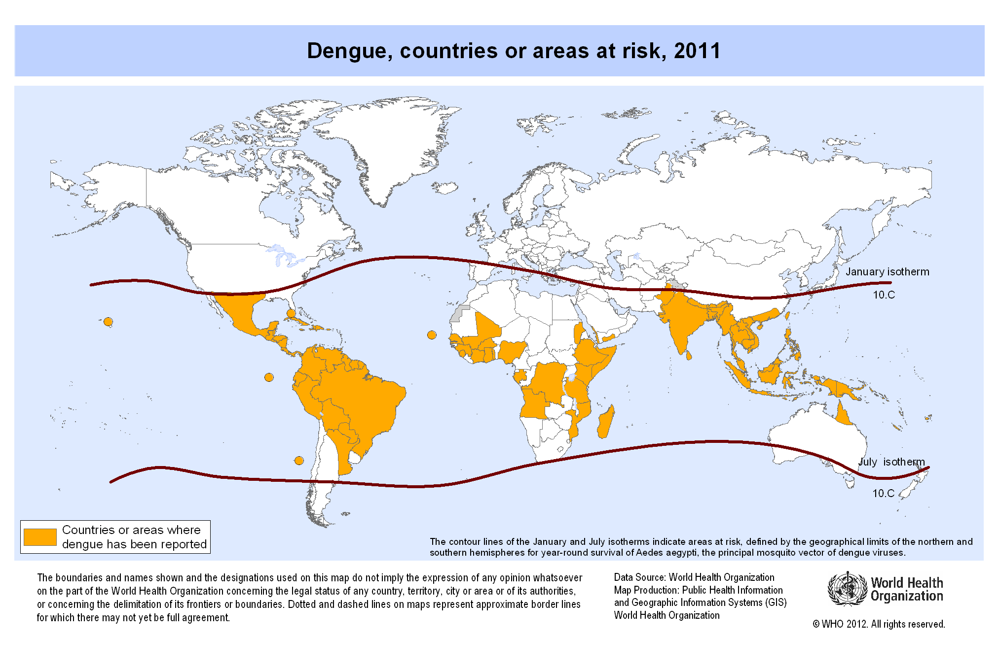

# Preface {-}

This is a _sample_ book written in **Markdown**. 

For now, you have to install the development versions of **bookdown** from Github:

```{r eval=FALSE}
devtools::install_github("rstudio/bookdown")
```

```{r echo=FALSE}



```


```{r include=FALSE}
# automatically create a bib database for R packages
knitr::write_bib(c(
  .packages(), 'bookdown', 'knitr', 'rmarkdown'
), 'packages.bib')

```
